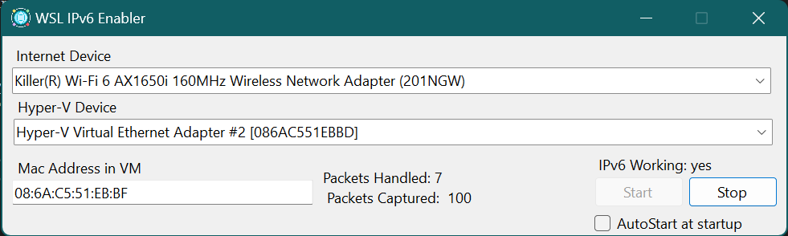

# WSL IPv6 packet enabler

IPv6 on Windows and WSL has been a bane of my existence for years. When working 
on a project that specifically required IPv6, I realized I'd have to figure out
what was going on. Thus this little program was born.

## Requirements

There are several requirements to use this.

### Bridge mode

WSL must be running in bridge mode. For example, here is my `/mnt/c/Users/lande/.wslconfig` file:

```ini
[wsl2]
networkingMode=bridged #<--
vmSwitch=wsl #<--
dhcp=true #<--
ipv6=true #<--
macAddress=08:6a:c5:51:eb:bf #<--

memory=4GB
processors=2
localhostforwarding=true #<--
debugConsole=false
```

The "vmSwitch" is a normal bridged network interface set in hyper-v management console.

I then set up my `/etc/resolv.conf` by configuring systemd-resolved: `sudo ln -sf /run/systemd/resolve/stub-resolv.conf /etc/resolv.conf`

## PCAP

I haven't installed this on a fresh computer, but it may required to have winpcap (I have wireshark) installed.

## Why doesn't IPv6 work in WSL??

After much investigation and fiddly bits with wireshark, I came to realize that IPV6 packets weren't 
being forwarded to WSL correctly. I don't know why, but for whatever reason no one at Microsoft is 
smart enough or cares enough to fix what is probably a really simple bug.

Thus, this incredibly simple program was born.

## What this program does

1. Starts a ping command from WSL
1. Listens for ipv6 packets sent to the Windows host with the "wrong" mac address.
2. Resends them with the correct mac address to the bridge.
3. Once the ping indicates the routes are learned (by seeing DUP! ping replies), stops rewriting packets until the connection fails again.
4. Thats it.



## Using the program

Once the network discovers the correct route, this program is not required. You have to "train" your
network and Windows to allow ipv6 packets to work correctly and this program helps with that.

Here's the gist:

1. Start this program.
2. Select your wifi device for the internet.
3. Select your bridge device -- note these can be the same device if required.
4. Enter the mac address of WSL (`08:6a:c5:51:eb:bf` using the example given above).
5. Push start.
7. Connection will enter a degraded state until the routes are learned.
8. Connection will finally say "yes" and then ipv6 will work natively.

As long as WSL continues to ping an ipv6 address, ipv6 connectivity will work without any further work.

### Get the program

You can either download the source and build it yourself or download the binary from releases.

## Why does this work?

Initial connections take a few packets going to the wrong place before eventually going to the right place (and this 
program will handle that). You only need it to "train" your network 
to send packets to the right place. Once you've done that, IPv6 will continue running just fine until the network "forgets" the
route.
